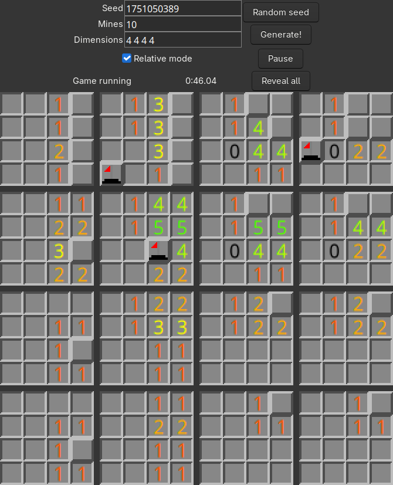

# Multi-dimensional minesweeper

Multi-dimensional minesweeper made with racket's gui library

> [!NOTE]
> This is my first racket project (other than a test file to figure out the syntax). It is quite laggy. I do plan on remaking this in c and in js with react, but idk when that is gonna happen...

## How to play

You have to find all the mines in a multi-dimensional field. The pink cursor highlights the current field you're on and its value shows the number of bombs that are around it. To help you find which fields are in the area of influence of the cursor, they are highlighted in a less saturated shade of pink. Have fun finding all the mines!

### Controls

<pre>
  Move right in x:       right arrow
  Move left in x:        left arrow
  Move up in y:          up arrow
  Move down in y:        down arrow
  Move right in z:       d
  Move left in z:        a
  Move up in q:          w
  Move down in y:        s
  Mark bomb:             m, e, right click
  Uncover field:         space, left click
  Pause game:            p, P
</pre>

Movement will overflow into the next dimension when possible

## Running

Run it like you would with any other racket file in drracket
